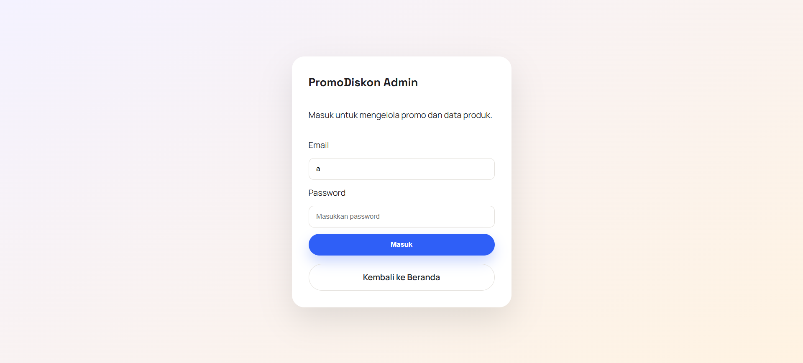
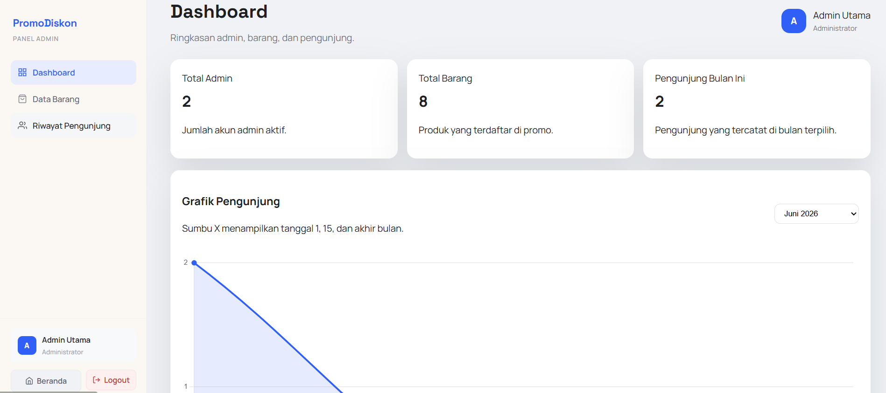
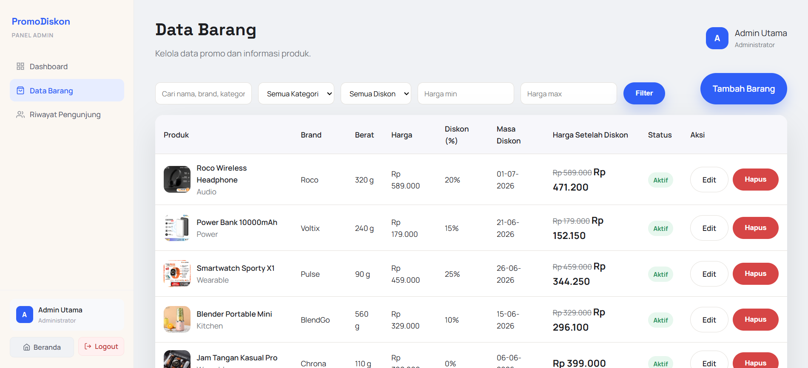
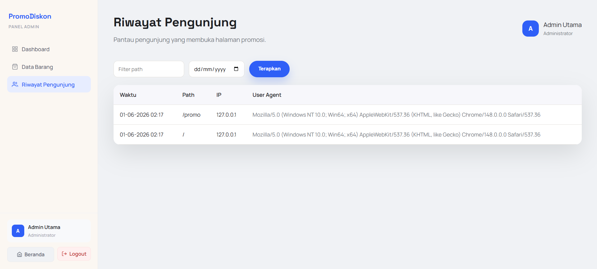

# PromoDiskon

Website promosi diskon produk berbasis Laravel, dilengkapi panel admin untuk mengelola data barang, memantau pengunjung, dan menampilkan promo secara real-time kepada publik.

---

## Tampilan

### Halaman Beranda


### Halaman Promo


### Login Admin


### Dashboard Admin


### Data Barang Admin


### Riwayat Pengunjung Admin


---

## Fitur

**Publik**
- Halaman beranda dengan produk unggulan dan statistik promo
- Halaman promo lengkap dengan filter kategori, diskon, dan rentang harga

**Admin**
- Dashboard ringkasan data produk dan statistik pengunjung
- CRUD data barang dengan drag & drop gambar
- Riwayat log pengunjung

---

## Tech Stack

- **Backend:** Laravel, PHP 8.2
- **Frontend:** Blade, Vite, Vanilla CSS
- **Database:** MySQL

---

## Instalasi

```bash
# 1. Clone & install dependencies
composer install
npm install

# 2. Salin konfigurasi environment
cp .env.example .env
php artisan key:generate

# 3. Sesuaikan konfigurasi database di .env, lalu jalankan migrasi
php artisan migrate --seed

# 4. Build asset frontend
npm run build

# 5. Jalankan server
php artisan serve
```

Akun admin default tersedia setelah seeder dijalankan (lihat `database/seeders/AdminSeeder.php`).
